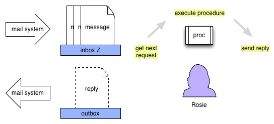
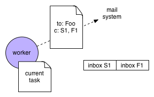
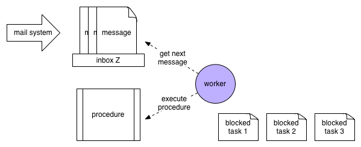

## Exa Concepts

Imagine a worker – let's call her Rosie – with an inbox having an **address**, and a **procedure** to be performed for each message she receives. Assume there's a mail system that routes messages into the inbox. Rosie attends the inbox, pulling messages out in the order in which they arrive and performing her procedure for each one as a distinct **task**. In doing so, she's performing a **service** defined by the procedure and accessible via the address, as shown below. If there are no messages she sits idly.

Rosie also has access to an outbox where she can drop messages for delivery, so long as she has an address to send them to. These messages are always either a **request** to be sent to another service or a **reply** in response to a request made of her service. Whenever she sends a reply she indicates either success or failure, and she can only send one reply per request; *success or failure is indicated by the address to which her reply is sent* – every request can include two reply addresses, one for reporting success and one for reporting failure.

Since a person can only do one thing at a time, Rosie is only ever working on one task at a time, and as a **sequential** process – one instruction at a time. So if she is occupied with a task when more messages arrive, those messages will sit in her inbox until she has time to get to them. This will either be when she's done with her current task or when that task becomes *blocked*, meaning she can't do anything more on it until she receives a reply to a request she sent. If it's the latter situation, she'll temporarily set her current task aside and pick up the next message in her queue, if any.

Rosie is very organized, so when she starts on a task she prepares a space called a **frame** to keep track of the state of the task; if she has to put the task aside, the frame keeps everything in place, ready to be picked up again.

### Making Requests

Depending on the instructions in her procedure, Rosie may or may not need to receive a reply when she makes a request. If she needs a reply, she creates a special temporary inbox (a **continuation**) just for this purpose and includes its address on the request, like a return address on an envelope. Likewise, if she wants to listen for a failure reply she creates a similar temporary inbox and includes its address on the request, as shown below.

Note:

- Even if Rosie listens for both replies she's guaranteed to only ever receive one or the other or neither – in no case will a request produce both a success reply and a failure reply.
- If the worker doesn't care about receiving a reply of either type, she can fire off the request without any reply addresses.
- Without a reply address, the communication is one-way.

### Summarizing the Exa Model of Computation

- A service has an inbox with an address and a procedure
  - The inbox is attended by one or more workers who collectively provide the service, but these are invisible within the system.
- The inbox receives and stores requests until a worker can process them
- An instance of a performing the procedure for a request is called a task
- A task has a frame to keep track of its state
- Performing a task may entail sending requests to other services
- To send a request, the address of the service must be known
- A request can include zero or two reply addresses
- A reply address is for a special temporary service called a continuation
- A task may produce either a success reply, a failure reply, or no reply
- In the course of executing a task new services may be created
- A task for a subservice is performed in the context of the parent task and has access to its state

Nested contexts.

Now it may be the case that the worker's procedure says: in the course of handling a message, create a new inbox, and when you receive messages on it, perform a certain procedure. This has the effect of creating a new service in the context of the task.

Now imagine there are a bunch of workers milling around without cubicles, looking for things to do. When a cubicle worker says "hey, I could use some help with this!" and anyone not currently working on something can roll her chair over.  You can have multiple copies of the same service in different locations to save time - two inboxes with the same address.

Now imagine that this inbox gets a lot of traffic – to keep up, we may need to have more than one worker attending it. Conversely, imagine we have multiple inboxes, each representing a different service – if there's not much traffic on any particular one, we could have one worker attend them all.