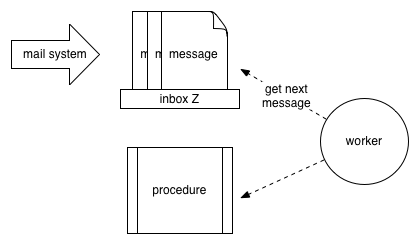

## Concepts

Imagine an inbox having a procedure associated with it, to be performed for each message received. This inbox has an address, and there's a mail system that routes messages sent to that address to it. Now imagine there's a worker who attends the inbox, pulling messages out in the order in which they arrive and performing the procedure for each one (a task). In doing so, this worker is performing a *service* defined by the procedure, as shown below.

Since a person can only do one thing at a time, if the worker is occupied processing one message when more arrive, those messages will sit in the inbox until she has time to get to them. This will either be when she's done with her current task or when she's *blocked*, meaning she can't do anything more on it until she receives a reply to a request she has sent.

If it's the latter situation, she'll temporarily set her current task aside and pick up the next message in her queue. If that message entails a new task (a *request*), she'll start in on it. If on the other hand it's a response to a request she has sent as part of one of her tasks (a *reply*), she'll pick up the relevant task and start cranking away where she left off.

In the course of performing a task, a worker may need to make a request of another service, which it can do provided it knows the address of that service – information that it can attach to a message to have the mail system route it to its destination. Without an address, there can be no communication.

Now imagine that this inbox gets a lot of traffic – to keep up, we may need to have more than one worker attending it. Conversely, imagine we have multiple inboxes, each representing a different service – if there's not much traffic on any particular one, we could have one worker attend them all.

Now it may be the case that the worker's procedure says: in the course of handling a message, create a new inbox, and when you receive messages on it, perform a certain procedure. This has the effect of creating a new service in the context of the task.

Now imagine there are a bunch of workers milling around without cubicles, looking for things to do. When a cubicle worker says "hey, I could use some help with this!" and anyone not currently working on something can roll her chair over.  You can have multiple copies of the same service in different locations to save time - two inboxes with the same address.
